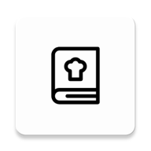

# **MyRecipes**

#### Let's Start Our Labs!

This application is purpose to help user find food or drink recipes.  
 

## Download App

## Features
- Explore Recipes
- Search Recipes
- Detail Recipes
- Favorite Recipes
- Food Joke
- Clean and Simple The New Material 3 UI
- Light Mode and Dark Mode 🌗

## 📸 Screenshots
||||
|:----------------------------------------:|:-----------------------------------------:|:-----------------------------------------: |
| 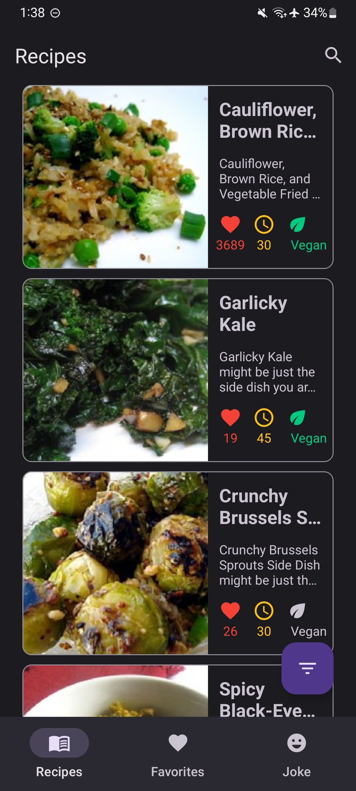 | 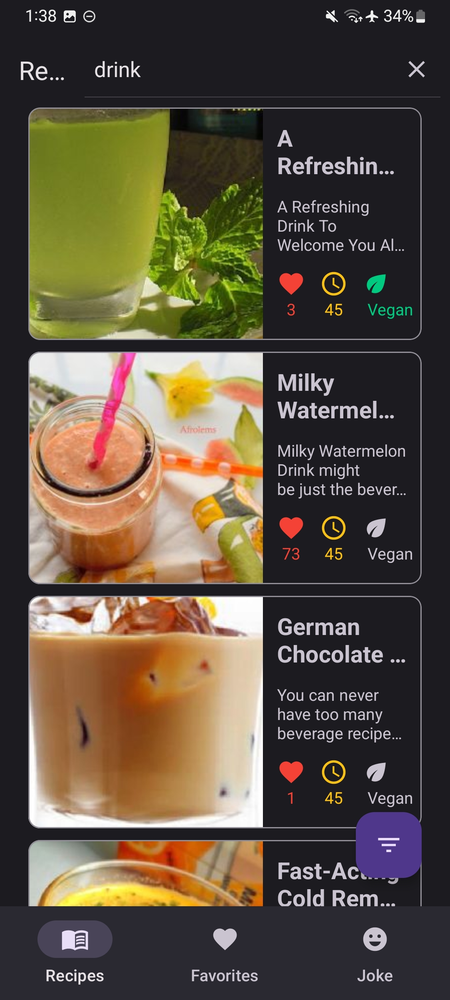 | 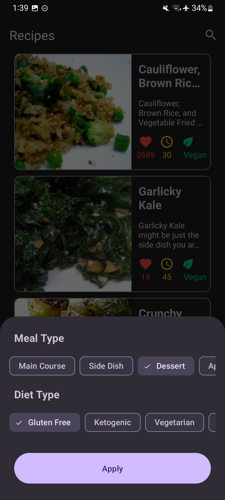 |
| 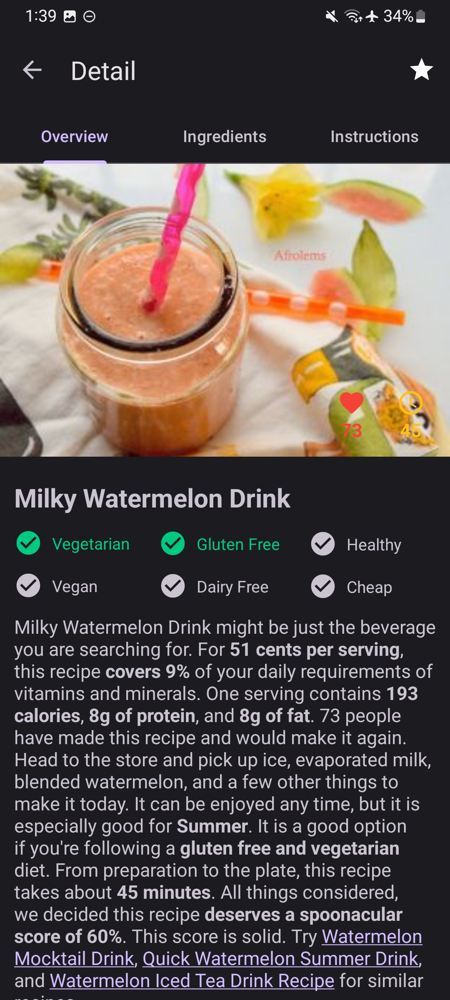 | 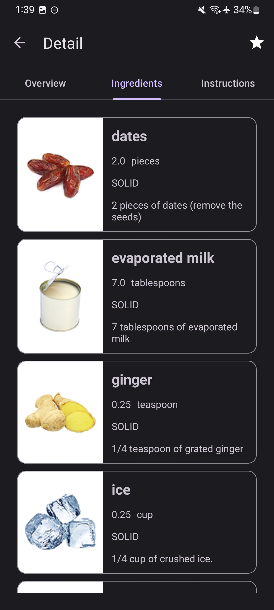 | 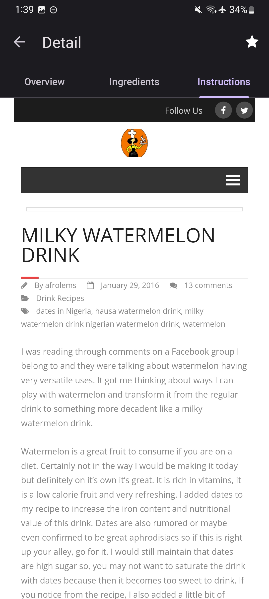 |
| 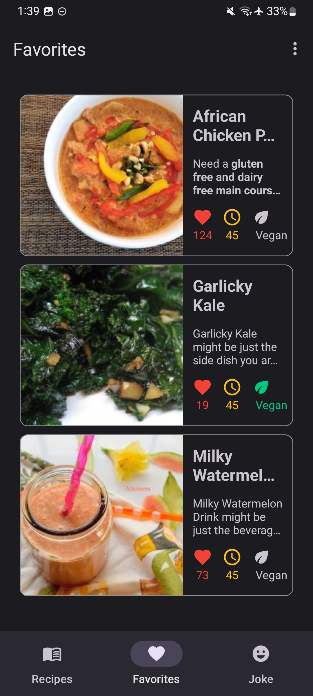 | 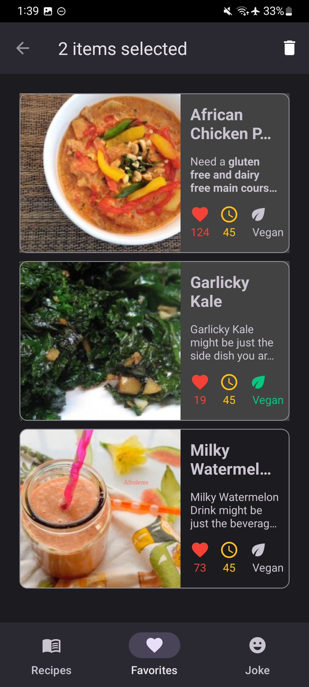 | 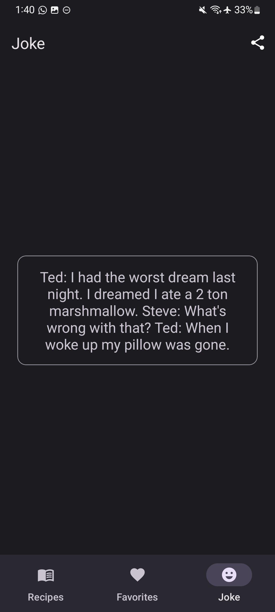 |
| 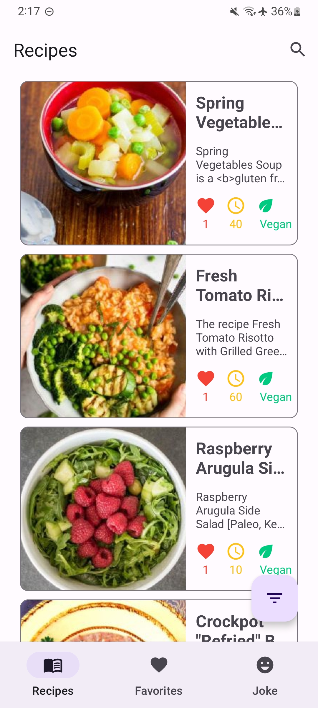 |  |  |

## Built With 🛠
- Kotlin
    - Coroutines
- Android Jetpack
    - Flow
    - LiveData
    - ViewModel
    - Navigation UI
    - Room
    - Data Store
- Dagger-Hilt
- Retrofit
- GSON Converter
- Coil
- Shimmer